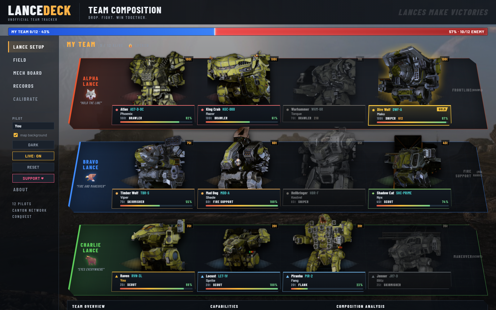
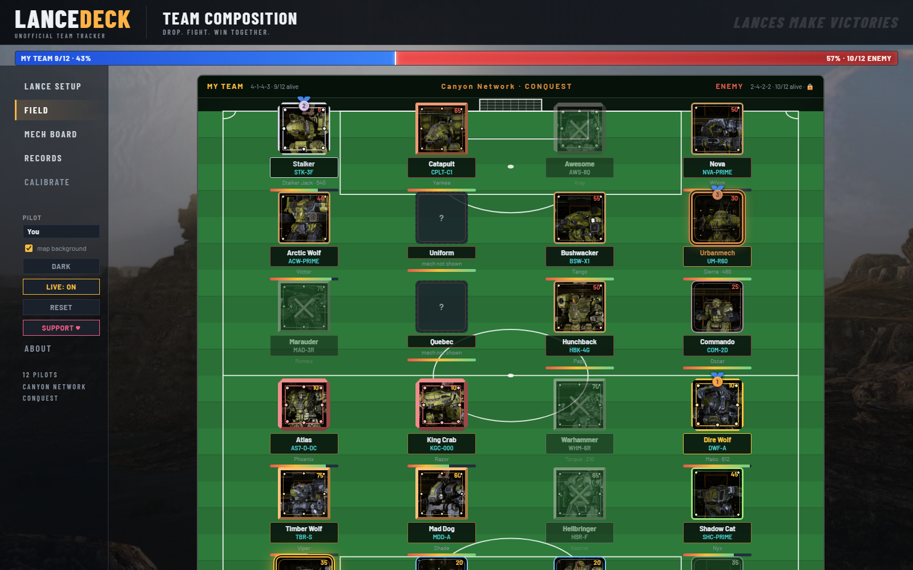
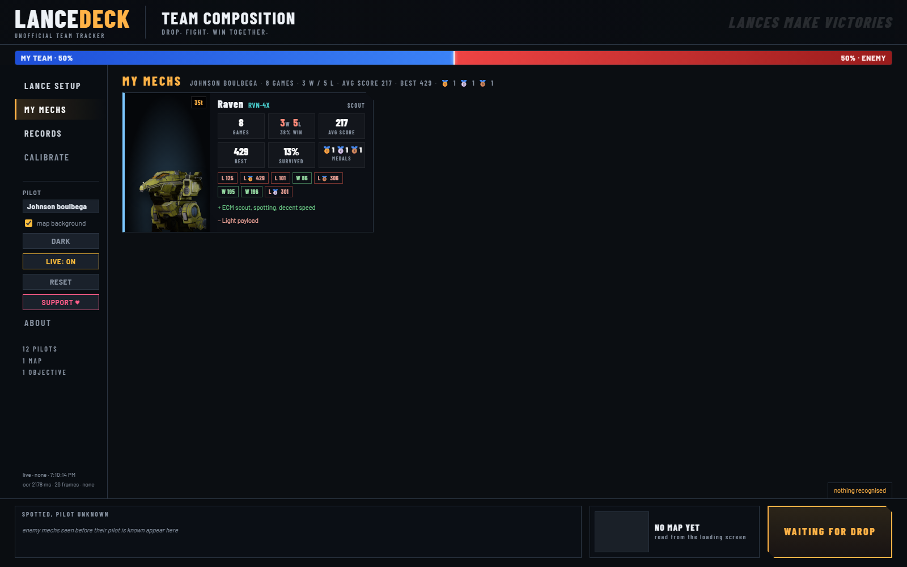
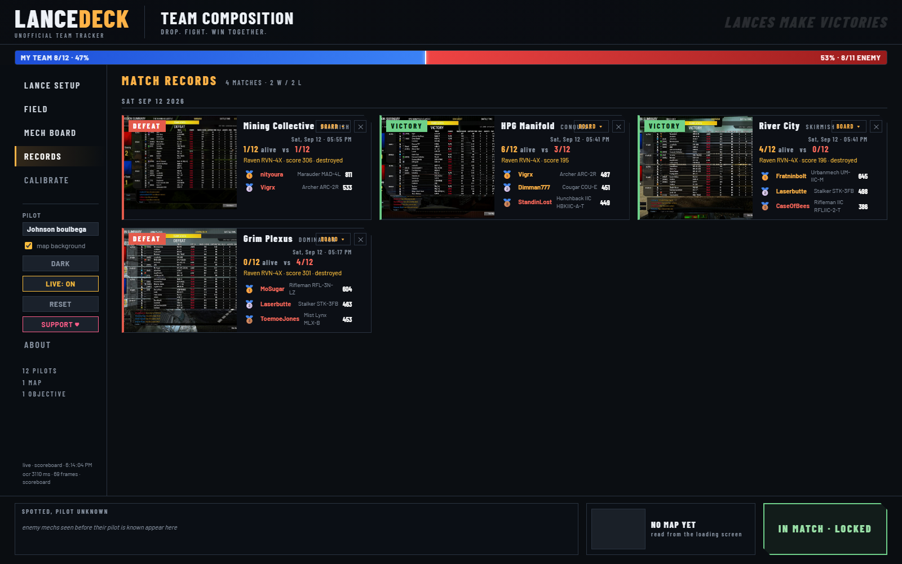

# LanceDeck

A free, unofficial team tracker for **MechWarrior Online**. It watches your own screen while
you play and turns the scoreboard, the lance panel, the Q overlay and the target readouts into
a live team composition page: both teams as three lances of four, every mech with its picture,
role and tonnage, who is alive, who is dead, the enemy loadouts you have locked, a who-is-winning
bar, and at the end the results with gold, silver and bronze for the best match scores. Every
match is kept as a record with its final screen.

**It reads pixels and nothing else.** No memory reading, no input injection, no network calls
to the game. Everything it records stays on your computer.

Not affiliated with or endorsed by Piranha Games Inc. MechWarrior and BattleTech are trademarks
of their respective owners. Mech and map pictures are copied out of *your own* game install on
first run and are never redistributed with this app.

## What it looks like

**Lance setup** — both teams as three lances of four, every mech on its pad with pilot, tonnage, role, health and the enemy loadouts you have locked. Your seat is framed in amber, medallists in gold, silver and bronze.



**Field** — the twelve seats of each side on a pitch, your goal at the bottom.



**Mech board** — cards by weight class with the strengths and weaknesses of each chassis.



**Records** — every match's final screen, result, survivors, your score and each team's medallists; each record unfolds into the board of that match.



## Install

1. Download the latest release zip and unpack it anywhere.
2. Run `LanceDeck.exe`. A console window opens and the setup page appears in your browser.
3. Type your pilot name as it shows in game, check the game folder, click **Save & import**.
   The mech icons and map art are copied from your game files and the mechs are cut out of
   their backdrop (a few minutes, once).
4. Play. Keep the page on a second screen or open `http://<this-pc>:8765` on a phone.

If Windows SmartScreen shows "Windows protected your PC", click **More info** then **Run anyway**: releases are moving to a signed build (docs/SIGNING.md); until then the warning only means Windows does not know the publisher yet.

## What it needs from you in game

Nothing you do not already do. Press **TAB** once at the start so both teams are read (the
loading screen does it too), lock enemies to read their loadout, and stay on the results
screen a couple of seconds at the end so the record is written.

## Views

- **Lance setup**: both teams, Alpha / Bravo / Charlie, mechs standing on their pads, team
  overview with tonnage, class mix and capabilities.
- **Field**: the twelve seats of each side on a football pitch.
- **Mech board**: cards by weight class with pros and cons.
- **Records**: every match's final screen, results and medal winners, with the board of that
  match; the last five games also remember which pilot drove which mech.

## Performance

Runs in quiet mode by default: OCR on the CPU on four threads at a low priority so the GPU
stays with the game. `ocr_dml: true` in `config.json` moves OCR to the GPU (faster, but it can
cost frames).

## Support

The app is free. If it helps you win, a donation keeps it maintained through the game's
patches: the **Support** button in the app, or the Sponsor button on this repository.

## From source

```
py -3.12 -m venv .venv
.venv\Scripts\pip install -r requirements.txt
.venv\Scripts\python run_app.py
```

Build the shareable app with `powershell build\build.ps1`.

## Privacy

The helper captures the game window only, keeps a few sample frames of the scoreboard and the
results screen in `samples\` for tuning, the final screen of each match in `records\`, and a
`sightings.log` of what it read. Delete any of them whenever you like. Nothing is uploaded.
